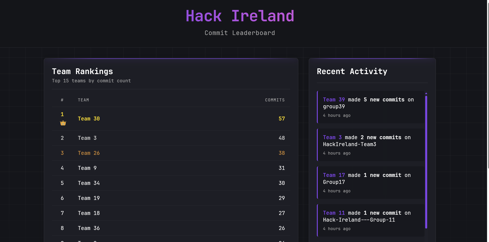

# HackIrelandLeaderboard

Nice little Flash web app to show hack ireland github activity!

`pip install -r requirements.txt`

Create a .env file with your github token (`GITHUB_TOKEN=your_token`)

Run: `python app.py`
